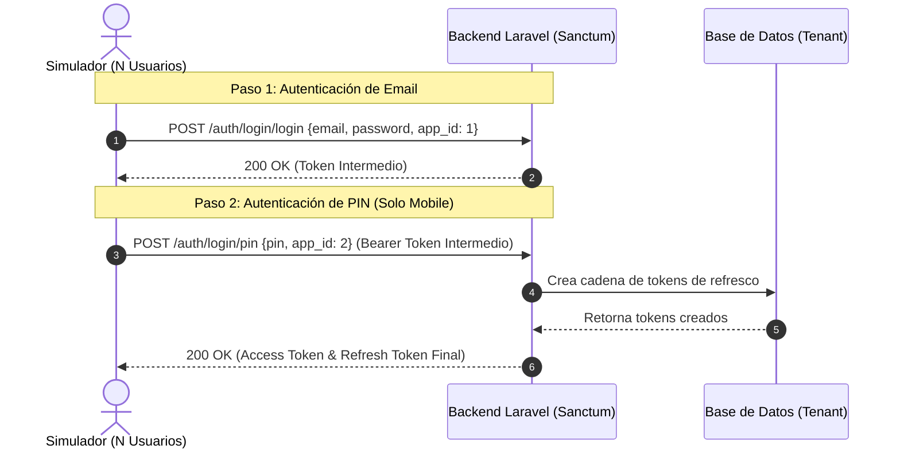

# 🚀 Guía Técnica & Documentación: Simulador de Estrés de Autenticación

Esta documentación describe la arquitectura, lógica de funcionamiento, opciones de configuración y diagnósticos del script de simulación de estrés concurrente (`auth-stress-simulator.js`) implementado en el proyecto de pruebas.

> [!IMPORTANT]
> El simulador se acopla estrictamente a las variables de entorno declaradas en tu archivo `.env`. No almacena credenciales ni URLs quemadas, garantizando seguridad y portabilidad entre ambientes (QA, Pre, Prod).

---

## 📊 Arquitectura del Simulador

El simulador emula la lógica de cliente de una aplicación móvil o web real utilizando interceptores Axios avanzados. Soporta la emulación de múltiples usuarios virtuales concurrentes interactuando de forma competitiva sobre la base de datos de tokens.



---

## ⚙️ Parámetros de Configuración del Script

Puedes ejecutar el script directamente desde la raíz del proyecto usando Node.js. Soporta argumentos de consola dinámicos para sobrescribir los valores por defecto del `.env`:

| Argumento | Variable en `.env` | Descripción | Valor por Defecto |
| :--- | :--- | :--- | :--- |
| `--url` | `VITE_API_BASE_URL` | URL base del API de Laravel. | `http://localhost:8001/api/v2` |
| `--users` | - | Cantidad de usuarios virtuales concurrentes. | `5` |
| `--concurrency` | - | Peticiones simultáneas por usuario en Fase 1. | `3` |
| `--email` | `VITE_DEFAULT_EMAIL` | Correo electrónico de pruebas. | Desde `.env` |
| `--password` | `VITE_DEFAULT_PASSWORD` | Contraseña del usuario. | Desde `.env` |
| `--pin` | `VITE_DEFAULT_PIN` | Código PIN (Flujo Móvil). | Desde `.env` |
| `--client` | `VITE_DEFAULT_CLIENT_TYPE` | Tipo de flujo: `mobile` (2 pasos) o `web` (1 paso). | Desde `.env` |
| `--loop` | - | Ejecutar en bucle infinito de estrés continuo. | `false` |
| `--interval` | - | Frecuencia de pings en milisegundos en modo bucle. | `5000` (5s) |

---

## 🚀 Comandos de Ejecución

Para iniciar el simulador, ejecuta el siguiente comando en la terminal desde la raíz del proyecto (`/var/www/html/refresh_tokens`):

```bash
# 1. Ejecución simple de concurrencia y ataque replay
node auth-stress-simulator.js

# 2. Ejecución en bucle continuo (para ver rotación de tokens en vivo cada 10s)
node auth-stress-simulator.js --loop=true --interval=10000

# 3. Personalizando la URL del backend de destino
node auth-stress-simulator.js --url=http://localhost:8001/api/v2 --loop=true --interval=5000
```

---

## 👥 Configuración Multiusuario con JSON (`stress-users.json`)

Si deseas simular múltiples usuarios con correos y códigos PIN diferentes (usando la misma contraseña global de pruebas configurada en el `.env`), puedes crear un archivo llamado `stress-users.json` en la raíz del proyecto.

### Ejemplo de Estructura de `stress-users.json`:
```json
[
  {
    "email": "system@eurofrutta.co.uk",
    "pin": "1231"
  },
  {
    "email": "system@foodpointproduce.co.uk",
    "pin": "2342"
  },
  {
    "email": "test@test.com",
    "pin": "3453"
  }
]
```

*Cuando el archivo `stress-users.json` está presente, el script creará automáticamente un usuario virtual para cada entrada del arreglo en lugar de utilizar los valores individuales del `.env`.*

---

## 🔄 Fases de Simulación Detalladas

### Fase 1: Simulación de Expiración y Concurrencia (Race Condition Interceptor)
1. **Corrupción de Token:** Cada usuario virtual altera deliberadamente su Access Token activo enviando `"INVALID_OR_EXPIRED_TOKEN"`.
2. **Llamadas Superpuestas:** Envía `N` peticiones concurrentes (`--concurrency=3`) al endpoint protegido `/suppliers/users/information/139` con ligeros desfases de red (jitter de 50ms).
3. **Control de Flujo:**
   - La primera llamada devuelve `401 Unauthorized`, gatillando el interceptor para pausar las demás y llamar a `/auth/login/refresh`.
   - Las llamadas 2 y 3 quedan pausadas en memoria (`failedQueue`) esperando que se resuelva la rotación.
   - Una vez rotado el token con éxito, todas las llamadas pausadas se reintentan de forma transparente con el nuevo token.
4. **Verificación:** Si el backend procesa las colas sin expulsar al usuario, la ventana de gracia (`grace_seconds`) está funcionando correctamente.

### Fase 2: Simulación de Replay Attack (Duplicidad de Token de Refresco)
1. **Ataque de Reutilización:** Dispara **dos llamadas de refresco en paralelo con el mismo token exacto** al mismo milisegundo.
2. **Bloqueo de Seguridad:** El backend debe resolver el primer refresco correctamente y revocar de inmediato toda la cadena de tokens en el segundo refresco al detectar la reutilización (Replay), respondiendo con `401` y rompiendo la sesión.

### Modo Bucle Continuo (`--loop=true`)
Diseñado para pruebas de fatiga y estabilidad multisesión a largo plazo:
```
[Inicio de Ciclo] ➔ [Pings Saludables (Ciclos 1, 2, 3)] ➔ [Provocación de Expiración (Ciclo 4)] ➔ [Rotación Concurrente] ➔ [Repetir]
```
Si el backend expulsa por error a cualquiera de las sesiones concurrentes debido a bloqueos de transacciones en la base de datos o falsos positivos de seguridad, el script **detiene el bucle inmediatamente e imprime un diagnóstico de colapso**.

---

## 🔍 Interpretación de Logs de Consola

### Caso A: Rotación y Concurrencia Exitosa (Comportamiento Correcto)
```text
[User #1] ⚡ Simulating 3 concurrent protected API calls...
   [User #1] Dispatching call 1...
   -> [User #1] ⚠️ 401 Unauthorized caught on [GET /suppliers/users/information/139]...
   [User #1] Dispatching call 2...
   -> [User #1] ⏳ Queueing overlapping request [/suppliers/users/information/139]
   [User #1] Dispatching call 3...
   -> [User #1] ⏳ Queueing overlapping request [/suppliers/users/information/139]
   -> [User #1] 📤 POST /auth/login/refresh | Payload: {"refresh_token":"uuid-token..."}
   -> [User #1] 📥 Response 200 from /auth/login/refresh | Rotated successfully!
   [User #1] Call 1 Succeeded | Status 200
   [User #1] Call 2 Succeeded | Status 200
   [User #1] Call 3 Succeeded | Status 200
📊 Concurrency Results: 3 Succeeded, 0 Failed
```

### Caso B: Choque de Concurrencia / Replay (Fallo de Sesión Caída)
```text
[User #1] ⚡ Simulating 3 concurrent protected API calls...
   ...
   -> [User #1] ❌ CRITICAL: Refresh failed [Status 401]! Body: {"message":"Invalid or expired refresh token"}
   [User #1] Call 1 Failed | Status 401 | Body: "Unauthorized"
   [User #1] Call 2 Failed | Status 401 | Body: "Unauthorized"
   [User #1] Call 3 Failed | Status 401 | Body: "Unauthorized"
📊 Concurrency Results: 0 Succeeded, 3 Failed
```
> [!TIP]
> Si experimentas el **Caso B**, dirígete a la pestaña **📡 Security Telemetry** en tu dashboard web para inspeccionar el `headers_dump` y confirmar si ocurrió un `replay_attack` o si las cookies HttpOnly se perdieron en el balanceador.
